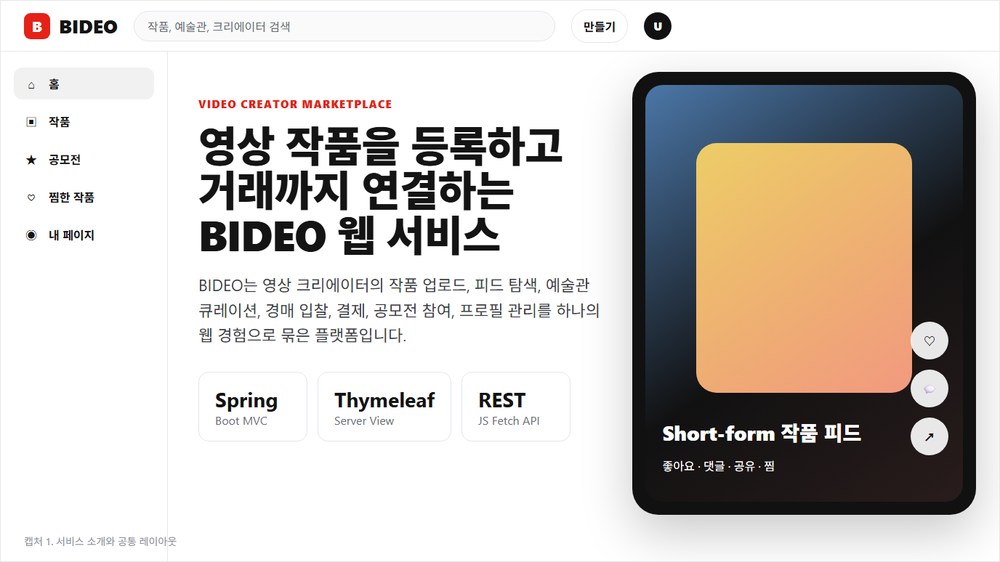
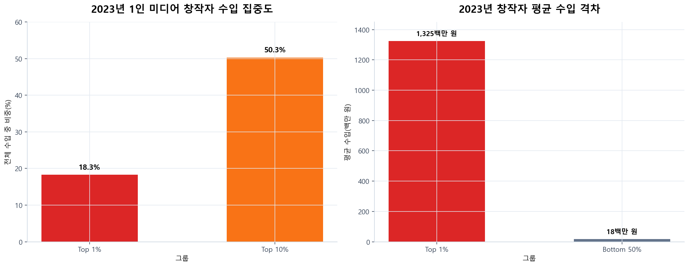
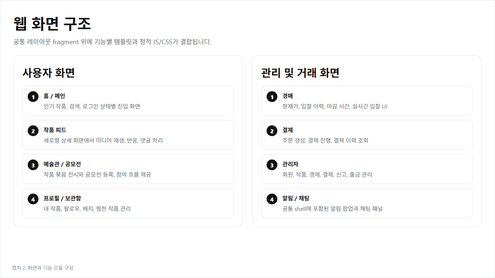
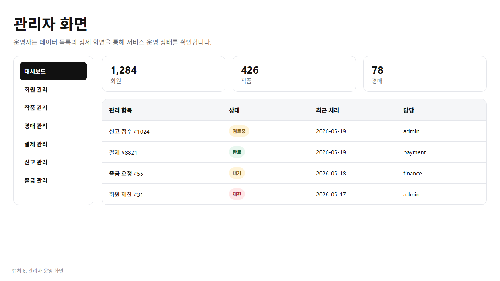
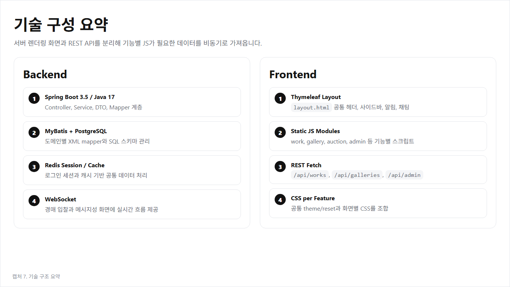
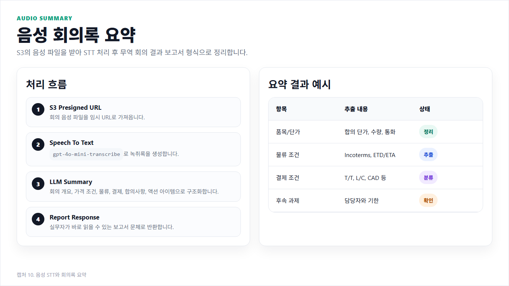

# BIDEO 웹 서비스 발표자료

> BIDEO 소스 학습 내용을 바탕으로 만든 발표용 캡처 자료입니다.  

## 1. 서비스 소개

BIDEO는 영상 크리에이터가 작품을 등록하고, 사용자가 피드에서 탐색하며, 경매와 결제까지 이어갈 수 있는 영상 작품 마켓플레이스입니다. Spring Boot와 Thymeleaf 기반의 서버 렌더링 화면 위에 기능별 JavaScript가 REST API를 호출하는 구조입니다.

## 1-1. 데이터 기반 기획 근거

AI workspace의 `data-analysis` 자료를 바탕으로 BIDEO의 서비스 필요성을 뒷받침하는 그래프를 추가했습니다.

### 콘텐츠 시장 성장

국내 콘텐츠산업 매출은 2020년 128.3조 원에서 2024년 157.4조 원까지 증가했습니다. 영상 콘텐츠를 단순 소비 대상이 아니라 거래 가능한 디지털 자산으로 다룰 수 있는 시장 기반이 존재합니다.

### OTT 이용률과 유료 이용 증가

OTT 이용률은 2021년 69.5%에서 2024년 79.2%까지 상승했습니다. 유료 OTT 이용 경험도 함께 확대되고 있어, 사용자가 영상 콘텐츠에 비용을 지불하는 흐름이 강화되고 있습니다.

### 모바일·숏폼 중심 소비

2024년 스마트폰 이용률은 TV 이용률보다 높고, 스마트폰에서 자주 소비되는 콘텐츠는 숏폼과 OTT 중심입니다. BIDEO가 세로형 작품 피드와 빠른 탐색 UX를 채택한 근거입니다.

### 창작자 수익 집중 문제

1인 미디어 창작자 수익은 상위 창작자에게 집중되어 있습니다. BIDEO는 조회수와 광고 수익에만 의존하지 않고, 작품 자체를 경매와 거래로 연결하는 직접 수익화 경로를 제안합니다.

## 2. 웹 화면 구조

공통 레이아웃은 `templates/layout/layout.html` fragment가 담당합니다. 헤더, 검색, 사이드바, 알림, 채팅, 만들기 모달이 공통으로 제공되고, 각 화면은 기능별 템플릿과 CSS/JS를 조합합니다.

## 3. 작품 등록과 피드

작품 등록 화면에서는 제목, 설명, 가격 유형, 태그, 썸네일, 미디어 파일을 입력합니다. 등록된 작품은 `/work/feed`와 `/work/detail/{id}`에서 쇼츠형 상세 화면으로 노출되며, 좋아요, 댓글, 공유, 찜, 신고 흐름을 제공합니다.

## 4. 경매와 결제

작품 상세 화면 안에서 경매 패널이 함께 동작합니다. 사용자는 현재 최고가, 입찰 이력, 마감 시간을 확인하고 다음 입찰가로 입찰할 수 있습니다. 낙찰 이후에는 주문과 결제 화면으로 흐름이 이어집니다.

## 5. 예술관, 공모전, 프로필

예술관은 여러 작품을 하나의 전시 단위로 묶는 기능이고, 공모전은 목록, 등록, 참여 작품 제출 흐름을 제공합니다. 프로필 화면에서는 내 작품, 팔로우, 배지, 보관함 등 크리에이터 활동을 관리합니다.

## 6. 관리자 화면

관리자 화면은 회원, 작품, 경매, 결제, 신고, 출금 요청을 목록과 상세 화면으로 관리합니다. 운영자는 상태값을 기준으로 처리 대상을 확인하고, 서비스 운영 데이터를 한 화면에서 점검할 수 있습니다.

## 7. 기술 구성

- Backend: Spring Boot 3.5, Java 17, Spring Security, MyBatis, PostgreSQL, Redis, WebSocket
- Frontend: Thymeleaf layout fragment, 기능별 정적 JavaScript, CSS 분리
- API: `/api/works`, `/api/galleries`, `/api/auction`, `/api/payments`, `/api/admin/*`
- 화면: `/main`, `/work/feed`, `/gallery/{id}`, `/contest/list`, `/profile`, `/dashboard`, `/admin/*`

## 발표 순서 요약

1. BIDEO가 어떤 서비스인지 설명합니다.
2. 공통 웹 레이아웃과 화면 구성을 소개합니다.
3. 작품 등록부터 피드 노출까지 사용자 흐름을 설명합니다.
4. 경매 입찰과 결제 전환 흐름을 설명합니다.
5. 예술관, 공모전, 프로필로 확장되는 기능을 설명합니다.
6. 관리자 화면에서 운영 데이터를 관리하는 방식을 설명합니다.
7. 마지막으로 기술 스택과 API 구조를 정리합니다.

## 작성 파일

- `capture/bideo-presentation.html`: 캡처 원본 HTML
- `assets/slide-01.png` ~ `assets/slide-07.png`: 발표용 캡처 이미지
- `README.md`: 발표 문서
- `BIDEO_웹서비스_핵심코드_발표.md`: 예술관 등록, 작품 등록, 결제, 경매, 대시보드, 예술관 상세, 작품 상세 핵심 코드 주석 발표 자료

---

# FastAPI AI 발표자료

> BIDEO와 연동되는 FastAPI AI 서버를 기준으로 작성한 추가 발표자료입니다.

## 8. FastAPI AI 서버 역할

FastAPI는 Spring Boot 웹 서비스에서 무거운 AI 처리를 분리한 보조 서버입니다. BIDEO 화면에서 필요한 시점에 REST API로 호출하고, FastAPI는 OpenAI, LangChain, Redis, AWS S3, 저장된 ML 모델을 이용해 결과를 반환합니다.

## 9. 이미지 생성 및 분석 API

이미지 파이프라인은 프롬프트 입력, 이미지 생성, S3 업로드, 이미지 분석, 결과 반환 순서로 동작합니다. 주요 엔드포인트는 `/api/ai/image/generate`, `/api/ai/image/analyze`, `/api/ai/image/pipeline`입니다.

## 10. 음성 회의록 요약

S3에 저장된 음성 파일을 presigned URL로 가져온 뒤 STT 모델로 녹취록을 만들고, LLM이 회의 개요, 가격 조건, 물류 조건, 결제 조건, 주요 합의 사항, 후속 과제를 보고서 형태로 정리합니다.

## 11. 작품 성과 예측 API

작품 예측 기능은 저장된 pkl 모델을 처음 요청 시 로드한 뒤 재사용합니다. `/api/work/regression`은 예상 조회수를 예측하고, `/api/work/classification`은 LabelEncoder와 threshold를 사용해 고조회수 여부를 분류합니다.

AI workspace 기준 모델 산출물은 `data-analysis/models`에 저장되어 있습니다.

| 모델 파일 | 역할 | 입력 feature |
| --- | --- | --- |
| `bideo_regressor.pkl` | 예상 조회수 회귀 예측 | 25개 |
| `bideo_classifier.pkl` | 고조회수/저조회수 분류 | 19개 |
| `bideo_auction_success_classifier.pkl` | 경매 성공 후보 분류 | 21개 |

재학습 스크립트는 `data-analysis/retrain_bideo_from_csv.py`와 `data-analysis/retrain_bideo_from_db.py`입니다. CSV 기반 학습은 `bideo_video_auction_dataset_10000.csv`를 사용하고, DB 기반 학습은 PostgreSQL의 `tbl_work`, `tbl_auction`, `tbl_bid` 데이터를 feature로 변환합니다.

## 12. 작품 및 갤러리 추천

추천 API는 제목, 설명, 태그를 기반으로 텍스트 특징을 만들고 유사도를 계산합니다. 한국어 처리를 위해 Kiwi를 사용하고, TF-IDF 기반 유사도 계산으로 현재 갤러리에 없는 후보 작품을 추천합니다.

## 13. 경매 RAG 분석

경매 RAG 분석은 PDF 리포트를 인덱싱하고, 작품 정보와 경매 지표를 결합해 투자 분석 보고서를 생성합니다. `/api/auction/rag/index`는 문서 인덱싱을 담당하고, `/api/auction/rag/analyze`는 가격 매력도, 예상 낙찰가, ROI 시나리오, 입찰 추천을 반환합니다.

## FastAPI AI 발표 순서 요약

1. Spring Boot에서 AI 처리를 FastAPI로 분리한 이유를 설명합니다.
2. 이미지 생성/분석 파이프라인과 S3 업로드 흐름을 소개합니다.
3. 음성 파일을 STT와 LLM 요약으로 회의록화하는 과정을 설명합니다.
4. pkl 모델 기반 작품 성과 예측 구조를 설명합니다.
5. Kiwi와 TF-IDF 기반 추천 API를 설명합니다.
6. RAGAnything과 LightRAG를 이용한 경매 투자 분석 흐름을 정리합니다.

## FastAPI AI 작성 파일

- `capture/fastapi-ai-presentation.html`: FastAPI AI 캡처 원본 HTML
- `assets/fastapi-slide-08.png` ~ `assets/fastapi-slide-13.png`: FastAPI AI 발표용 캡처 이미지
- `assets/data-bideo-*.png`: AI workspace에서 가져온 BIDEO 데이터 분석 그래프
