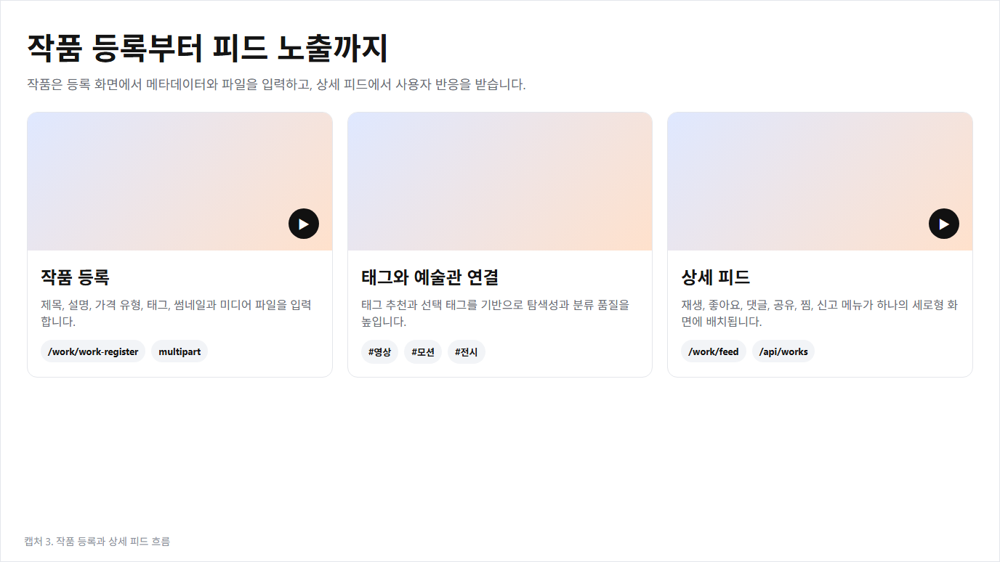
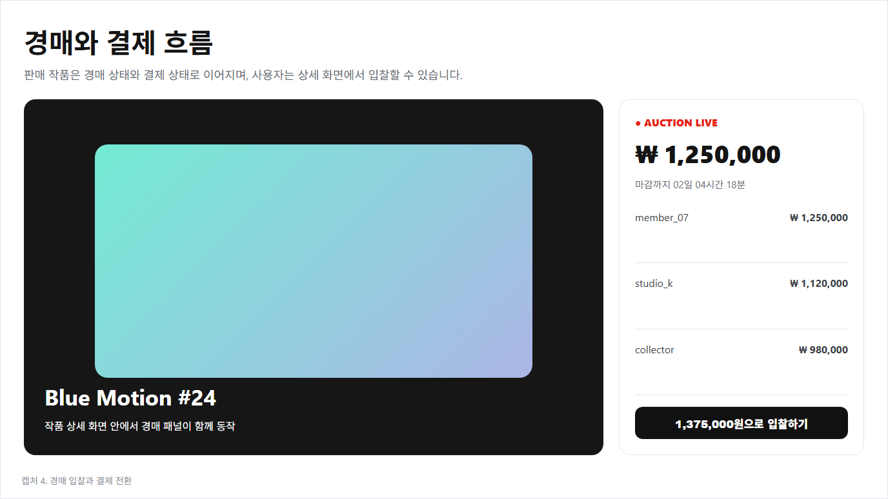
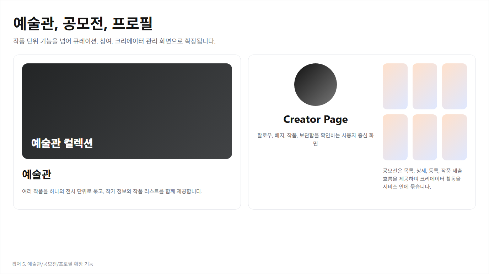
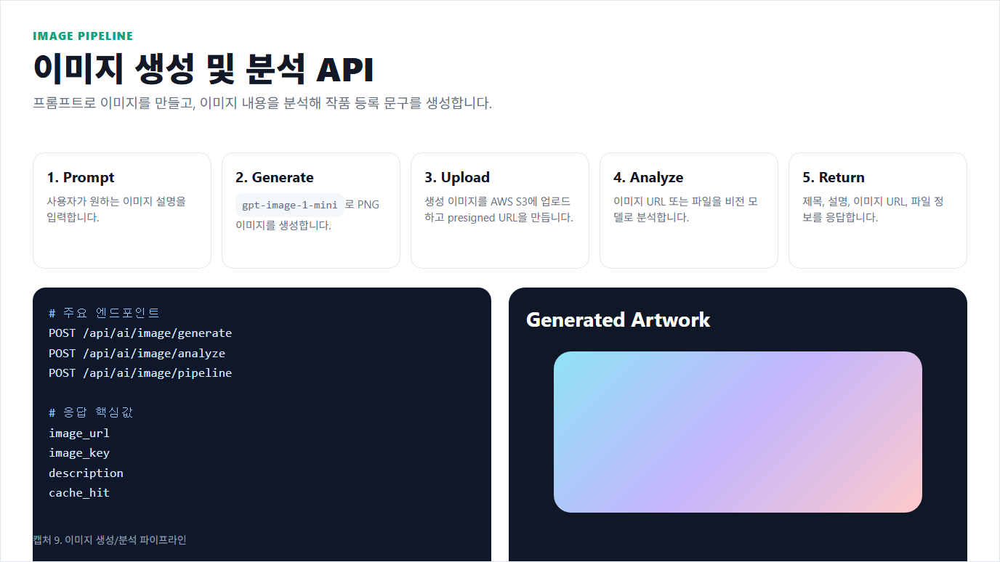
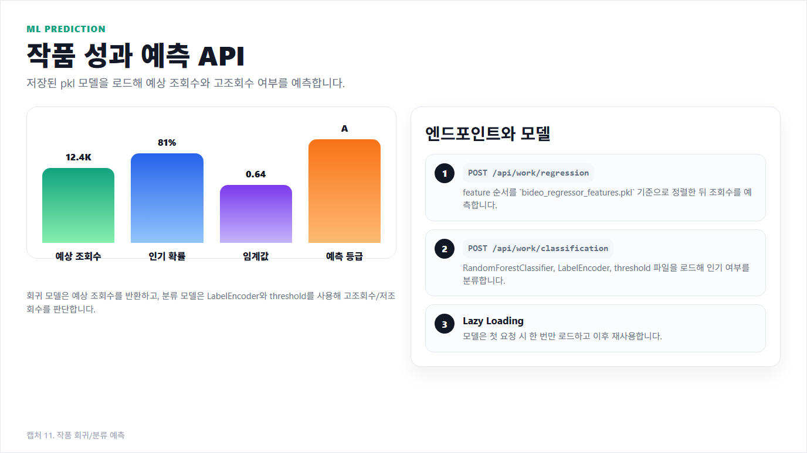
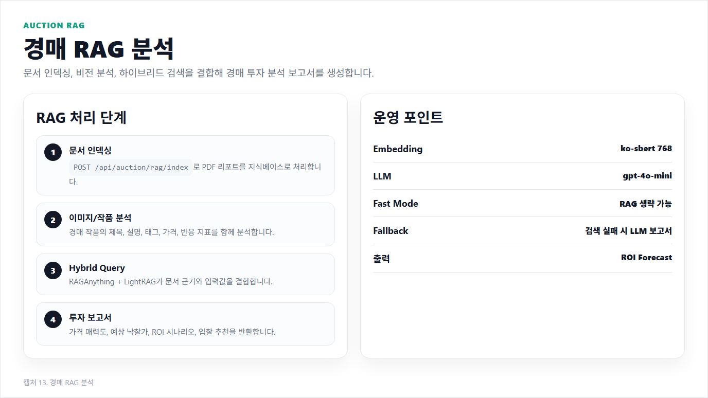

# BIDEO 웹서비스 핵심 코드 발표 정리


## 등록 흐름: 예술관 등록 / 작품 등록



### 예술관 등록

원본: `src/main/java/com/app/bideo/service/gallery/GalleryService.java`

```java
public GalleryCreateResponseDTO write(Long memberId, GalleryCreateRequestDTO requestDTO, MultipartFile coverFile) {
    Long resolvedMemberId = resolveMemberId(memberId);       // 로그인 사용자 확정
    requestDTO.setMemberId(resolvedMemberId);
    requestDTO.setCoverImage(saveCoverImage(coverFile));     // 커버 이미지는 S3 저장

    galleryDAO.save(requestDTO);                             // tbl_gallery 저장
    saveWorkLinks(requestDTO.getId(), requestDTO.getWorkIds(), resolvedMemberId); // 전시 작품 연결
    saveTags(requestDTO.getId(), requestDTO.getTagIds(), requestDTO.getTagNames()); // 태그 연결
    galleryDAO.updateWorkCount(requestDTO.getId());          // 작품 수 갱신

    return GalleryCreateResponseDTO.builder()
            .galleryId(requestDTO.getId())
            .redirectUrl("/main?relatedGalleryId=" + requestDTO.getId())
            .build();
}
```

예술관은 커버 이미지, 작품 목록, 태그를 묶어 하나의 전시 공간으로 저장하는 기능입니다.

### 작품 등록

원본: `src/main/java/com/app/bideo/service/work/WorkService.java`

```java
public WorkCreateResponseDTO write(Long memberId, WorkCreateRequestDTO requestDTO,
                                   MultipartFile mediaFile, MultipartFile thumbnailFile) {
    Long resolvedMemberId = resolveMemberId(memberId);
    Long galleryId = requireGalleryId(requestDTO.getGalleryId());
    validateGalleryOwner(galleryId, resolvedMemberId);       // 내 예술관인지 검증

    WorkDTO workDTO = WorkDTO.builder()
            .memberId(resolvedMemberId)
            .title(limitText(requestDTO.getTitle(), 255))
            .price(requestDTO.getPrice())
            .mediaType(resolveMediaType(requestDTO.getCategory(), mediaFile, requestDTO.getFiles()))
            .predictedViews(defaultLong(requestDTO.getPredictedViews())) // AI 예측값 저장
            .status("ACTIVE")
            .build();

    workDAO.save(workDTO);                                   // tbl_work 저장
    saveThumbnailFile(workDTO.getId(), thumbnailFile);       // 썸네일 S3 저장
    saveMediaFile(workDTO.getId(), mediaFile, 1);            // 작품 파일 S3 저장
    saveTags(workDTO.getId(), requestDTO.getTagIds(), requestDTO.getTagNames());
    saveGalleryLink(galleryId, workDTO.getId());             // 예술관에 작품 연결
    saveAuctionIfRequested(workDTO.getId(), resolvedMemberId, requestDTO.getPrice(),
            requestDTO.getAuctionEnabled(), requestDTO.getAuctionStartingPrice(),
            requestDTO.getAuctionDeadlineHours());           // 경매 선택 시 경매 생성

    return WorkCreateResponseDTO.builder().id(workDTO.getId()).galleryId(galleryId).build();
}
```

 작품 등록은 파일 저장, 태그 저장, 예술관 연결, AI 예측값 저장, 경매 생성까지 이어지는 핵심 시작점입니다.

##  거래 흐름: 경매 / 결제



### 경매 입찰

원본: `src/main/java/com/app/bideo/service/auction/BidCommandService.java`

```java
public BidResponseDTO placeBid(Long memberId, BidRequestDTO requestDTO) {
    AuctionVO auction = auctionDAO.findRawById(requestDTO.getAuctionId());

    if (!"ACTIVE".equals(auction.getStatus())) throw new IllegalStateException("종료된 경매입니다.");
    if (auction.getSellerId().equals(memberId)) throw new IllegalArgumentException("자신의 경매에는 입찰할 수 없습니다.");
    if (requestDTO.getBidPrice() < Math.round(auction.getCurrentPrice() * 1.1)) {
        throw new IllegalArgumentException("최소 입찰 단위 이상으로 입찰해야 합니다.");
    }

    bidDAO.clearPreviousWinning(requestDTO.getAuctionId());  // 이전 최고 입찰 해제
    bidDAO.save(BidVO.builder()
            .auctionId(requestDTO.getAuctionId())
            .memberId(memberId)
            .bidPrice(requestDTO.getBidPrice())
            .isWinning(true)
            .build());

    auctionDAO.updateCurrentPrice(requestDTO.getAuctionId(), requestDTO.getBidPrice(),
            bidDAO.findBidderIds(requestDTO.getAuctionId()).size());

    return bidDAO.findHighestBid(requestDTO.getAuctionId()).orElse(null);
}
```

 입찰은 경매 상태, 판매자 본인 여부, 최소 10% 입찰 조건을 검증한 뒤 최고 입찰자를 갱신합니다.

### 결제 검증

원본: `src/main/java/com/app/bideo/service/payment/PaymentService.java`

```java
public PaymentResponseDTO confirmBootpayPayment(Long buyerId, BootpayConfirmRequestDTO requestDTO) {
    PaymentVO payment = paymentDAO.findRawById(requestDTO.getPaymentId())
            .orElseThrow(() -> new IllegalArgumentException("결제를 찾을 수 없습니다."));

    if (!payment.getBuyerId().equals(buyerId)) throw new IllegalArgumentException("결제 검증 권한이 없습니다.");
    if (!"PENDING".equals(payment.getStatus())) throw new IllegalStateException("이미 처리된 결제입니다.");

    JsonNode receipt = bootpayClient.getReceipt(requestDTO.getReceiptId()); // Bootpay 서버 검증
    if (!payment.getPaymentCode().equals(receipt.path("order_id").asText(""))) {
        throw new IllegalStateException("부트페이 주문번호가 일치하지 않습니다.");
    }
    if (receipt.path("price").asInt(-1) != payment.getTotalPrice()) {
        throw new IllegalStateException("부트페이 결제 금액이 일치하지 않습니다.");
    }

    return completePayment(payment.getId(), buyerId);        // 검증 성공 후 결제 완료
}
```

 프론트 결제 성공만 믿지 않고, 서버에서 Bootpay 영수증의 주문번호와 금액을 다시 확인합니다.

## 상세 화면: 예술관 상세 / 작품 상세



### 예술관 상세

원본: `src/main/java/com/app/bideo/service/gallery/GalleryService.java`

```java
public GalleryDetailResponseDTO getGalleryDetail(Long id) {
    GalleryDetailResponseDTO detail = galleryDAO.findById(id)
            .orElseThrow(() -> new IllegalArgumentException("gallery not found"));

    detail.setCoverImage(s3FileService.getPresignedUrl(detail.getCoverImage())); // S3 key -> URL
    detail.setTags(galleryDAO.findTagsByGalleryId(id));
    detail.setWorks(getGalleryWorks(id, detail.getMemberId()));

    Long memberId = resolveAuthenticatedMemberId();
    detail.setIsLiked(memberId != null && galleryDAO.existsLike(memberId, id));
    detail.setIsBookmarked(memberId != null && bookmarkDAO.exists(memberId, "GALLERY", id));
    detail.setIsOwner(memberId != null && memberId.equals(detail.getMemberId()));
    return detail;
}
```

발표 포인트: 예술관 상세는 커버, 태그, 포함 작품, 좋아요/북마크/소유자 상태를 한 번에 구성합니다.

### 작품 상세

원본: `src/main/java/com/app/bideo/service/work/WorkService.java`

```java
public WorkDetailResponseDTO getWorkDetail(Long id) {
    Long memberId = resolveAuthenticatedMemberId();
    WorkDetailResponseDTO detail = workDAO.findDetailById(id, memberId)
            .orElseThrow(() -> new IllegalArgumentException("work not found"));

    applyFileUrls(detail);                                   // 작품 파일 S3 URL 변환
    detail.setIsLiked(memberId != null && workDAO.existsLike(memberId, id));
    detail.setIsBookmarked(memberId != null && bookmarkDAO.exists(memberId, "WORK", id));
    detail.setIsOwner(memberId != null && memberId.equals(detail.getMemberId()));
    detail.setHasActiveAuction(workDAO.existsActiveAuctionByWorkId(id)); // 경매 패널 노출 여부

    return detail;
}
```

작품 상세는 미디어, 반응 상태, 소유자 여부, 활성 경매 여부를 합쳐 피드형 상세 화면을 만듭니다.

## 대시보드

원본: `src/main/java/com/app/bideo/service/dashboard/DashboardService.java`

```java
@Cacheable(value = "dashboard", key = "#memberId")
public DashboardResponseDTO getDashboard(Long memberId) {
    DashboardSummaryRawDTO summary = defaultSummary(dashboardMapper.selectDashboardSummary(memberId));

    int ownedWorkCount = nullSafe(dashboardMapper.selectOwnedWorkCount(memberId));
    int ownedGalleryCount = nullSafe(dashboardMapper.selectOwnedGalleryCount(memberId));
    LocalDate endDate = LocalDate.now();
    LocalDate startDate = endDate.minusDays(MAX_LOOKBACK_DAYS - 1L);

    Map<String, DashboardMetricSeriesDTO> analyticsMetrics = new LinkedHashMap<>();
    analyticsMetrics.put("works", buildMetricSeries("works", "내가 만든 작품 추이",
            String.valueOf(ownedWorkCount),
            toDailyMap(dashboardMapper.selectDailyCreatedWorkCounts(memberId, startDate, endDate)),
            true, "내 작품", "개", endDate));
    analyticsMetrics.put("galleries", buildMetricSeries("galleries", "내가 만든 예술관 추이",
            String.valueOf(ownedGalleryCount),
            toDailyMap(dashboardMapper.selectDailyCreatedGalleryCounts(memberId, startDate, endDate)),
            true, "내 예술관", "개", endDate));

    return DashboardResponseDTO.builder()
            .totalViewsText(formatCompactNumber(nullSafe(summary.getTotalViews())))
            .activeAuctionsText(formatTwoDigits(nullSafe(summary.getActiveAuctionCount())))
            .pendingPaymentsText(formatCurrencyCompact(nullSafe(summary.getPendingPaymentAmount())))
            .analyticsMetrics(analyticsMetrics)
            .ownedWorks(withFallback(dashboardMapper.selectOwnedWorkItems(memberId), "등록된 작품이 없습니다.", ""))
            .galleries(withFallback(dashboardMapper.selectGalleryItems(memberId), "예술관이 없습니다.", ""))
            .paymentHistory(withFallback(dashboardMapper.selectPaymentHistoryItems(memberId), "결제 이력이 없습니다.", ""))
            .build();
}
```

 대시보드는 조회수, 경매, 결제, 작품, 예술관 데이터를 모아 사용자의 운영 현황을 한 화면에 보여줍니다.


## 발표 흐름 요약

1. 예술관을 만들고 작품을 등록한다.
2. 등록된 작품은 상세 화면과 피드에서 소비된다.
3. 작품에 경매가 열리면 입찰이 진행된다.
4. 낙찰 또는 구매는 결제 검증을 거쳐 완료된다.
5. 대시보드에서 내 작품, 예술관, 거래 현황을 확인한다.


ㅡㅡㅡㅡㅡㅡㅡㅡㅡㅡㅡㅡㅡㅡㅡㅡㅡㅡㅡㅡㅡㅡㅡㅡㅡㅡㅡㅡㅡㅡㅡㅡㅡㅡㅡㅡㅡㅡㅡㅡㅡㅡㅡㅡㅡㅡㅡㅡㅡㅡㅡㅡㅡㅡㅡㅡㅡㅡㅡㅡㅡㅡㅡㅡㅡㅡㅡㅡㅡㅡㅡㅡㅡㅡㅡㅡㅡㅡㅡㅡㅡㅡㅡㅡ
ㅡㅡㅡㅡㅡㅡㅡㅡㅡㅡㅡㅡㅡㅡㅡㅡㅡㅡㅡㅡㅡㅡㅡㅡㅡㅡㅡㅡㅡㅡㅡㅡㅡㅡㅡㅡㅡㅡㅡㅡㅡㅡㅡㅡㅡㅡㅡㅡㅡㅡㅡㅡㅡㅡㅡㅡㅡㅡㅡㅡㅡㅡㅡㅡㅡㅡㅡㅡㅡㅡㅡㅡㅡㅡㅡㅡㅡㅡㅡㅡㅡㅡㅡㅡ
ㅡㅡㅡㅡㅡㅡㅡㅡㅡㅡㅡㅡㅡㅡㅡㅡㅡㅡㅡㅡㅡㅡㅡㅡㅡㅡㅡㅡㅡㅡㅡㅡㅡㅡㅡㅡㅡㅡㅡㅡㅡㅡㅡㅡㅡㅡㅡㅡㅡㅡㅡㅡㅡㅡㅡㅡㅡㅡㅡㅡㅡㅡㅡㅡㅡㅡㅡㅡㅡㅡㅡㅡㅡㅡㅡㅡㅡㅡㅡㅡㅡㅡㅡㅡ
ㅡㅡㅡㅡㅡㅡㅡㅡㅡㅡㅡㅡㅡㅡㅡㅡㅡㅡㅡㅡㅡㅡㅡㅡㅡㅡㅡㅡㅡㅡㅡㅡㅡㅡㅡㅡㅡㅡㅡㅡㅡㅡㅡㅡㅡㅡㅡㅡㅡㅡㅡㅡㅡㅡㅡㅡㅡㅡㅡㅡㅡㅡㅡㅡㅡㅡㅡㅡㅡㅡㅡㅡㅡㅡㅡㅡㅡㅡㅡㅡㅡㅡㅡㅡ
ㅡㅡㅡㅡㅡㅡㅡㅡㅡㅡㅡㅡㅡㅡㅡㅡㅡㅡㅡㅡㅡㅡㅡㅡㅡㅡㅡㅡㅡㅡㅡㅡㅡㅡㅡㅡㅡㅡㅡㅡㅡㅡㅡㅡㅡㅡㅡㅡㅡㅡㅡㅡㅡㅡㅡㅡㅡㅡㅡㅡㅡㅡㅡㅡㅡㅡㅡㅡㅡㅡㅡㅡㅡㅡㅡㅡㅡㅡㅡㅡㅡㅡㅡㅡ
ㅡㅡㅡㅡㅡㅡㅡㅡㅡㅡㅡㅡㅡㅡㅡㅡㅡㅡㅡㅡㅡㅡㅡㅡㅡㅡㅡㅡㅡㅡㅡㅡㅡㅡㅡㅡㅡㅡㅡㅡㅡㅡㅡㅡㅡㅡㅡㅡㅡㅡㅡㅡㅡㅡㅡㅡㅡㅡㅡㅡㅡㅡㅡㅡㅡㅡㅡㅡㅡㅡㅡㅡㅡㅡㅡㅡㅡㅡㅡㅡㅡㅡㅡㅡ
ㅡㅡㅡㅡㅡㅡㅡㅡㅡㅡㅡㅡㅡㅡㅡㅡㅡㅡㅡㅡㅡㅡㅡㅡㅡㅡㅡㅡㅡㅡㅡㅡㅡㅡㅡㅡㅡㅡㅡㅡㅡㅡㅡㅡㅡㅡㅡㅡㅡㅡㅡㅡㅡㅡㅡㅡㅡㅡㅡㅡㅡㅡㅡㅡㅡㅡㅡㅡㅡㅡㅡㅡㅡㅡㅡㅡㅡㅡㅡㅡㅡㅡㅡㅡ
ㅡㅡㅡㅡㅡㅡㅡㅡㅡㅡㅡㅡㅡㅡㅡㅡㅡㅡㅡㅡㅡㅡㅡㅡㅡㅡㅡㅡㅡㅡㅡㅡㅡㅡㅡㅡㅡㅡㅡㅡㅡㅡㅡㅡㅡㅡㅡㅡㅡㅡㅡㅡㅡㅡㅡㅡㅡㅡㅡㅡㅡㅡㅡㅡㅡㅡㅡㅡㅡㅡㅡㅡㅡㅡㅡㅡㅡㅡㅡㅡㅡㅡㅡ
ㅡㅡㅡㅡㅡㅡㅡㅡㅡㅡㅡㅡㅡㅡㅡㅡㅡㅡㅡㅡㅡㅡㅡㅡㅡㅡㅡㅡㅡㅡㅡㅡㅡㅡㅡㅡㅡㅡㅡㅡㅡㅡㅡㅡㅡㅡㅡㅡㅡㅡㅡㅡㅡㅡㅡㅡㅡㅡㅡㅡㅡㅡㅡㅡㅡㅡㅡㅡㅡㅡㅡㅡㅡㅡㅡㅡㅡㅡㅡㅡㅡㅡㅡㅡ
ㅡㅡㅡㅡㅡㅡㅡㅡㅡㅡㅡㅡㅡㅡㅡㅡㅡㅡㅡㅡㅡㅡㅡㅡㅡㅡㅡㅡㅡㅡㅡㅡㅡㅡㅡㅡㅡㅡㅡㅡㅡㅡㅡㅡㅡㅡㅡㅡㅡㅡㅡㅡㅡㅡㅡㅡㅡㅡㅡㅡㅡㅡㅡㅡㅡㅡㅡㅡㅡㅡㅡㅡㅡㅡㅡㅡㅡㅡㅡㅡㅡㅡㅡㅡ


# FastAPI AI 핵심 코드 발표 정리


##  FastAPI AI 서버 역할


원본: `main.py`

```python
from router import product, ai, work, gallery, auction_rag

app = FastAPI(lifespan=lifespan)
app.include_router(product.router)   # 기존 상품/기본 AI 기능
app.include_router(ai.router)        # 이미지 생성, 분석, 공용 AI 엔드포인트
app.include_router(work.router)      # 작품 회귀/분류 예측
app.include_router(gallery.router)   # 예술관 유사도 추천
app.include_router(auction_rag.router) # 경매 RAG 분석
```

Spring Boot가 무거운 AI 작업을 직접 처리하지 않고, FastAPI가 전담하는 구조입니다.

##  이미지 생성 및 분석



원본: `service/ai_service.py`

```python
async def run_image_pipeline(self, request: ImagePipelineRequest) -> ImagePipelineResponse:
    return await run_in_threadpool(self._run_image_pipeline, request)

def _run_image_pipeline(self, request: ImagePipelineRequest) -> ImagePipelineResponse:
    image_path = self._generate_image_file(  # OpenAI 이미지 모델로 생성
        prompt=request.prompt,
        size=request.size
    )
    description, cache_hit = self._analyze_image_with_cache(str(image_path))  # 생성 결과를 다시 분석
    uploaded_image = self._upload_image_to_s3(image_path)  # S3 업로드 후 key/url 확보

    return ImagePipelineResponse(
        image_path=str(image_path),
        description=description,
        image_key=uploaded_image["key"],
        image_url=uploaded_image["url"],
        file_type=uploaded_image["content_type"],
        file_size=uploaded_image["size"]
    )
```

 프롬프트를 받아 이미지를 만들고, 바로 분석한 뒤, S3 key와 presigned URL까지 반환합니다.

##  작품 성과 예측



원본: `service/work_service.py`

```python
async def predict_views(self, features: WorkRegressionFeatures) -> WorkRegressionResponse:
    self.load_work_regressor()  # pkl 모델과 feature 순서를 1회만 로드

    feature_dict = features.model_dump()
    values = [feature_dict[name] for name in self.work_regressor_features]  # 학습 당시 순서에 맞춤
    prediction = self.work_regressor.predict([values])

    return WorkRegressionResponse(
        predicted_views=int(prediction[0]),
        created_datetime=datetime.now(),
        updated_datetime=datetime.now()
    )
```

회귀 모델은 저장된 pkl과 feature 순서를 맞춰 예상 조회수를 계산하고, 첫 호출 이후에는 메모리 재사용으로 성능을 확보합니다.

## 유사도 추천


원본: `service/work_recommend_service.py`

```python
work_texts = [
    f"{r['title']} {r['title']} {r['category']} {r['description']} {r['tags']}"
    for r in rows
]

tfidf_v = TfidfVectorizer(
    analyzer="char_wb",     # 한국어 토큰 분리 한계를 보완하는 문자 n-gram 방식
    ngram_range=(2, 4),
    max_features=6000,
)
tfidf_mat = tfidf_v.fit_transform(work_texts)
query_mat = tfidf_v.transform([request.content])
sim_scores = cosine_similarity(query_mat, tfidf_mat)[0]
```

 제목, 설명, 태그를 하나의 텍스트로 합치고, Kiwi 기반 전처리와 TF-IDF 유사도 계산으로 추천 점수를 만듭니다.

## 경매 RAG 분석



원본: `service/auction_rag_service.py`

```python
async def analyze(self, request: AuctionRagAnalyzeRequest) -> AuctionRagAnalyzeResponse:
    if request.fast_mode:
        return await self._analyze_fast(request)  # RAG 검색을 생략한 빠른 분석

    rag = await self.get_rag()                  # RAGAnything 초기화 및 재사용
    image_data = self._resolve_image_base64(request)
    image_analysis = await rag.vision_model_func(
        self._build_image_prompt(request),
        image_data=image_data,
    )

    rag_query = self._build_rag_query(request, image_analysis)
    auction_report = await rag.aquery(rag_query, mode="hybrid")  # 문서 검색 + LLM 결합

    return AuctionRagAnalyzeResponse(
        image_analysis=str(image_analysis),
        auction_report=str(auction_report),
        used_rag=True,
        indexed_document_hint=str(DEFAULT_REPORT_PATH),
    )
```

 빠른 모드와 RAG 모드를 분리해서, 즉시 응답과 문서 기반 정밀 분석을 모두 지원합니다.

## 발표 흐름 요약

1. FastAPI는 Spring이 호출하는 AI 전용 백엔드입니다.
2. 이미지 생성은 생성, 분석, S3 저장을 한 번에 묶어 처리합니다.
3. 작품 예측은 저장된 pkl 모델과 feature 순서를 그대로 사용합니다.
4. 추천은 텍스트 유사도 기반으로 후보를 정렬합니다.
5. 경매 RAG는 빠른 분석과 문서 기반 정밀 분석을 분리합니다.
